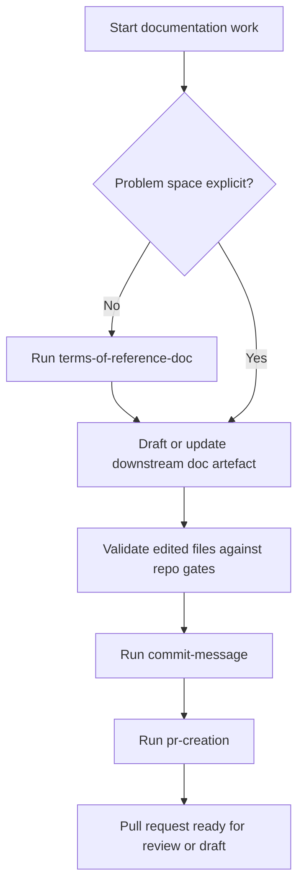

# Users' Guide

*How to use df12 documentation workflow skills together.*

This guide is for documentation practitioners using the skills in this
repository to prepare problem statements, branch hand-offs, commit history and
pull request review surfaces. It gives the operating flow; each skill file
remains the authority for detailed rules.

______________________________________________________________________

## Workflow overview

Use the skills as a sequence rather than isolated snippets:

1. Use
   [`terms-of-reference-doc`](../skills/terms-of-reference-doc/SKILL.md)
   before solution work when the problem space is not yet explicit.
2. Draft or update the downstream documentation artefact in the target
   repository.
3. Validate the edited files with the repository's documented gates.
4. Use [`commit-message`](../skills/commit-message/SKILL.md) to write a
   file-backed Git commit message.
5. Use [`pr-creation`](../skills/pr-creation/SKILL.md) to prepare the pull
   request title and description from the full branch diff.

At release time — a separate cadence from per-branch work — use
[`changelog`](../skills/changelog/SKILL.md) to curate `CHANGELOG.md` from the
commits and pull requests in the release range, then commit the changelog
edit before creating the git tag.

This keeps the branch narrative consistent from local commit to pull request
review, and from pull request to released changelog entry.



Screen reader caption: Documentation work starts by checking whether the
problem space is explicit. If it is not, run `terms-of-reference-doc` before
drafting or updating the downstream document. If it is explicit, go directly to
the downstream document. Then validate the edited files against the repository
gates, run `commit-message`, run `pr-creation`, and leave the pull request in
the appropriate ready-for-review or draft state.

______________________________________________________________________

## Terms of reference

Use
[`terms-of-reference-doc`](../skills/terms-of-reference-doc/SKILL.md) before
technical design or roadmap work when the project needs a defensible statement
of why it exists, who it serves and what sits outside scope.

The skill produces `docs/terms-of-reference.md` unless the user specifies a
different target. It is an elicitation-led workflow: first read prior art, then
build a provisional sketch with `[KNOWN]`, `[ASSUMED]` and `[OPEN]` claims,
resolve the gaps one question at a time, and only then consolidate the draft.

Terms of reference belong to the problem space, not the solution space. They
capture domain context, market context, users and stakeholders,
job-to-be-done, goals, non-goals, success criteria, hard constraints,
assumptions, dependencies and open questions. Architecture, implementation
sequence and technology choices should move to downstream design or roadmap
documents.

Use the finished terms of reference as the upstream input for
[`tech-design-doc`](../skills/tech-design-doc/SKILL.md) and
[`roadmap-doc`](../skills/roadmap-doc/SKILL.md). If it introduces domain terms
that are not already in `docs/context.md`, list those as companion context
additions during hand-off.

______________________________________________________________________

## Commit messages

Use [`commit-message`](../skills/commit-message/SKILL.md) when staging or
committing documentation changes.

The skill requires a temporary message file and `git commit -F`. This avoids
inline shell quoting problems, accidental command substitution and unreadable
multi-line `git commit -m` invocations.

A good commit message states the behavioural or documentation effect first,
then explains why the change was needed when that is not obvious from the
summary.

______________________________________________________________________

## Pull request descriptions

Use [`pr-creation`](../skills/pr-creation/SKILL.md) when opening or revising a
pull request.

The skill requires new pull requests to be created as drafts unless the user
explicitly asks for a ready-for-review PR. When revising an existing pull
request, preserve its current draft or ready state unless the user explicitly
asks for that state to change.

The description must cover the full branch, not only the latest commit. Start
with what changed and why, then give reviewers purpose-first entrypoints into
the files they should read.

Write the pull request body to a temporary Markdown file with a single-quoted
heredoc delimiter before passing it to GitHub tooling. This protects the
description from shell expansion of variables, command output, backticked code
spans and escape sequences.

Prefer the GitHub app when it is available. Use GitHub CLI only when the app is
unavailable or cannot perform the required pull request operation.

______________________________________________________________________

## Release notes

Use [`changelog`](../skills/changelog/SKILL.md) when cutting a new release,
drafting release notes between two tags, promoting a prerelease to stable, or
documenting a yanked release.

The skill maintains `CHANGELOG.md` in the Common Changelog style: releases
sorted latest-first by Semantic Versioning, ISO 8601 dates, four allowed
categories (`Changed`, `Added`, `Removed`, `Fixed`), `**Breaking:**` prefixes
on breaking entries, and a linked reference on every line. There is no
`Unreleased` section: pending changes live in commits and pull requests until
the release is cut, and the entry is curated at that moment.

The workflow assumes the upstream artefacts produced earlier in this guide:

1. After the pull request lands and the release tag is ready, gather the
   commit range between the previous tag and `HEAD` (or between the two tags
   being documented), along with the merged pull requests in that range.
2. Curate, do not paste. Strip dotfile changes, dev-only dependency bumps and
   purely cosmetic edits. Rephrase commit subjects so different contributors'
   wording converges. Merge related commits into single entries with multiple
   references.
3. Write each entry in the imperative mood, one line, with at least one
   Markdown-linked reference (commit, pull request, issue or external
   ticket). Use `**Breaking:**` for breaking changes and place them before
   non-breaking changes within their category.
4. Commit the changelog edit using
   [`commit-message`](../skills/commit-message/SKILL.md) before creating the
   git tag, so the tag points at a commit whose `CHANGELOG.md` already
   describes it.

The skill explicitly rejects Conventional Commit prefixes inside entries,
`Unreleased` sections, `[YANKED]` tags and regional date formats. Where a
release has no real change content (initial release, stable promotion of a
prerelease, fully yanked release), use a single-sentence italicized notice in
place of the change groups.

______________________________________________________________________

## Review references

Follow the `pr-creation` skill contract for issue and roadmap references. For
issue-based pull requests, use `ISSUE-<number>: <short-description>` as the
title format and include `Closes ISSUE-<number>` in the description. If using
GitHub issue numbers, use `Fixes #<number>` instead.

For roadmap-task pull requests, use `TASK-<id>: <short-description>` as the
title format. Include an `Implements TASK-<id>` line in the description, plus a
brief bullet explaining how the change satisfies the task.

If an execplan exists, link it from the pull request description and state
whether the branch implements it or carries a pre-implementation plan.

Use Markdown links for every file mentioned in the pull request description.
Prefer commit-specific links after the branch has been pushed.

______________________________________________________________________

## Validation evidence

Record validation commands in the pull request description after the review
walkthrough. For skill documentation changes, the usual focused checks are:

```bash
SKILL_CREATOR="${CODEX_HOME:-$HOME/.codex}/skills/.system/skill-creator"
uv run --with pyyaml python \
  "$SKILL_CREATOR/scripts/quick_validate.py" \
  skills/<skill-name>
markdownlint-cli2 README.md skills/<skill-name>/SKILL.md
git diff --check
```

Run broader repository gates when the project defines them. If a broader gate
fails on pre-existing files outside the branch scope, report that clearly and
keep the focused evidence for touched files visible.
